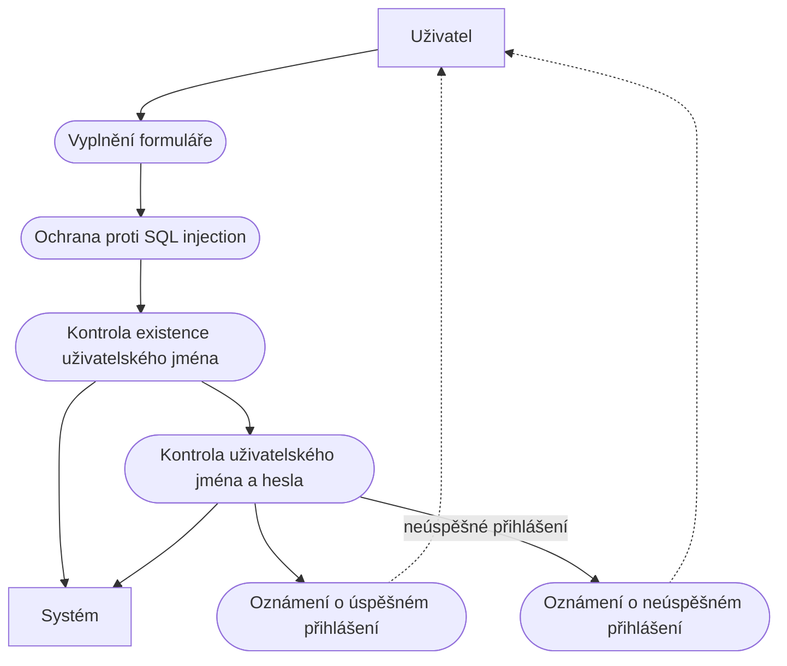

# Test analytika
## Datový model

## Wireframe

## UseCase

## K čemu je vhodný BPMN
Pomocí notace BPMN (Business Process Modeling Notation), což je standard pro modelování obchodních procesů, můžete vytvářet dokumentaci k procesům, upřesňovat ji a komunikovat o ní s týmy na všech úrovních.

Cílem modelování byznys procesů v BPMN je vytvoření takových modelů, kterým budou rozumět nejen IT odborníci, ale i lidé z byznysu, tedy manažeři, vlastníci procesů, odborníci na zajišťování kvality a další.

BPMN 2.0 je komplementární s dalšími dvěma standardy vydávanými organizací OMG, což jsou CMMN (Case Management Model and Notation) a DMN (Decision Model and Notation).
## Jaké CASE nástroje znáte (pro UML, datové modelování)
- Enterprise Architect
- Visual Paradigm
- MagicDraw
- PowerDesigner
- Oracle SQL Developer Data Modeler
- MS Visio
- Draw.io

## Jaké znáte databázové prostředky
- Microsoft SQL Server
- PostgreSQL
- MySQL
- MariaDB
- Oracle
- MS Access
- MongoDB
- CouchDB
- ElasticSearch
- Apache Hadoop

## Uveďte některé prototypovací nástroje a k čemu je prototypování dobré
- Figma
- InVision
- Moqups
- Draw.io

Účelem prototypů je umožnit budoucím uživatelům softwaru vyhodnotit návrhy designu výsledného produktu skutečným používáním namísto interpretace a vyhodnocování jeho popisů.

Prototyp obvykle simuluje pouze některé aspekty výsledného produktu a může se od výsledného produktu výrazně lišit.

- **Horizontální prototyp** - Poskytuje podrobný náhled na celý systém nebo subsystém zaměřený spíše na uživatelské interakce než na nízkoúrovňovou funkčnost systému, jako je například přístup k databázi.
- **Vertikální prototyp** - Úplnější propracování jediného subsystému nebo funkce. Poskytne informace pro zjemnění návrhu databáze, získání informací o objemu dat a potřebách na systémové rozhraní, pro určení kapacity sítě.

## Uveďte některé role v teamu vývoje SW
- Team leader
- Produktový manager
- Architekt
- Analytik
- Programátor
- Tester
- DevOps

## Co je REST API, jaké jsou jeho základní principy
### What is a REST API?

An API, or *application programming interface*, is a set of rules that define how applications or devices can connect to and communicate with each other. A REST API is an API that conforms to the design principles of the REST, or *representational state transfer* architectural style. For this reason, REST APIs are sometimes referred to RESTful APIs.

### REST design principles

At the most basic level, an [API](https://www.ibm.com/topics/api) is a mechanism that enables an application or service to access a resource within another application or service. The application or service doing the accessing is called the client, and the application or service containing the resource is called the server.

Some APIs, such as SOAP or XML-RPC, impose a strict framework on developers. But REST APIs can be developed using virtually any programming language and support a variety of data formats. The only requirement is that they align to the following six REST design principles - also known as architectural constraints:

1. **Uniform interface**. All API requests for the same resource should look the same, no matter where the request comes from. The REST API should ensure that the same piece of data, such as the name or email address of a user, belongs to only one uniform resource identifier (URI). Resources shouldn’t be too large but should contain every piece of information that the client might need.
2. **Client-server decoupling**. In REST API design, client and server applications must be completely independent of each other. The only information the client application should know is the URI of the requested resource; it can't interact with the server application in any other ways. Similarly, a server application shouldn't modify the client application other than passing it to the requested data via HTTP.
3. **Statelessness**. REST APIs are stateless, meaning that each request needs to include all the information necessary for processing it. In other words, REST APIs do not require any server-side sessions. Server applications aren’t allowed to store any data related to a client request.
4. **Cacheability**. When possible, resources should be cacheable on the client or server side. Server responses also need to contain information about whether caching is allowed for the delivered resource. The goal is to improve performance on the client side, while increasing scalability on the server side.
5. **Layered system architecture**. In REST APIs, the calls and responses go through different layers. As a rule of thumb, don’t assume that the client and server applications connect directly to each other. There may be a number of different intermediaries in the communication loop. REST APIs need to be designed so that neither the client nor the server can tell whether it communicates with the end application or an intermediary.
6. **Code on demand (optional)**. REST APIs usually send static resources, but in certain cases, responses can also contain executable code (such as Java applets). In these cases, the code should only run on-demand.

## Popište základní principy a výhody mikroslužeb
- Rozdělení na malé, na sobě nezávislé aplikace.
- Komunikace buď pomocí API nebo pomocí asynchronních zpráv (lepší).
- Snazší škálovatelnost jednotlivých mikroslužeb.
- Cloud-ready.
- Možnost realizace pomocí různých vývojových platforem, jako .NET, Python, Java, Go, Rust, ...
- Mohou využívat různé typy databází.
- Inkrementální nahrazení monolitu (Strangler Fig Pattern).